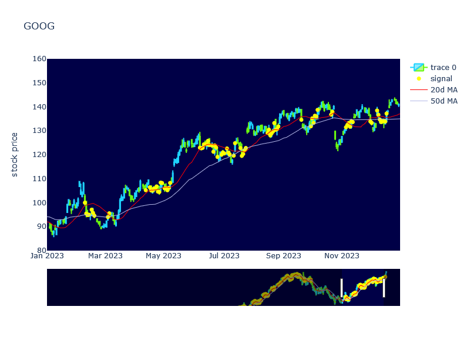

## Sample notebook for analysing signals with chart illustration

Traders often look for various ways of generating signals, based on specific stock price/volume data, or broader market indices. Then the next logical step is to combine a number of signals to form complex signals, and see if any reasonable execution strategy can be deployed on that basis.

In analysing signals, apart from statistical metrics, it is useful to see how visually such signals are flagged out in the charts, for fine-tuning the the component of signals and adjusting the definition of successful signals (or labels in data science terms).

This sample notebook takes in the end-of-day stock price/volume and index data, and features generated from such data. The notebook also allows for computing simple metrics across multiple-stock time-series data in Pandas dataframes.

Additional features (eg bullish/bearish market) are taken from separate csv files defined in notebooks outside this scope.

Definition of the sample signal:
- Market not bearish
- Daily low near 20d MA and not far below 50d MA

#### Sample plot of signals on chart for illustration

